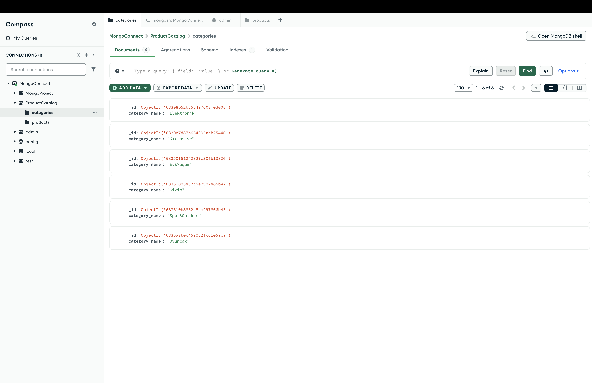
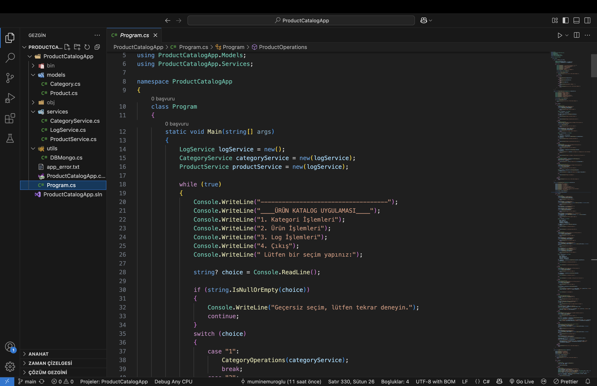
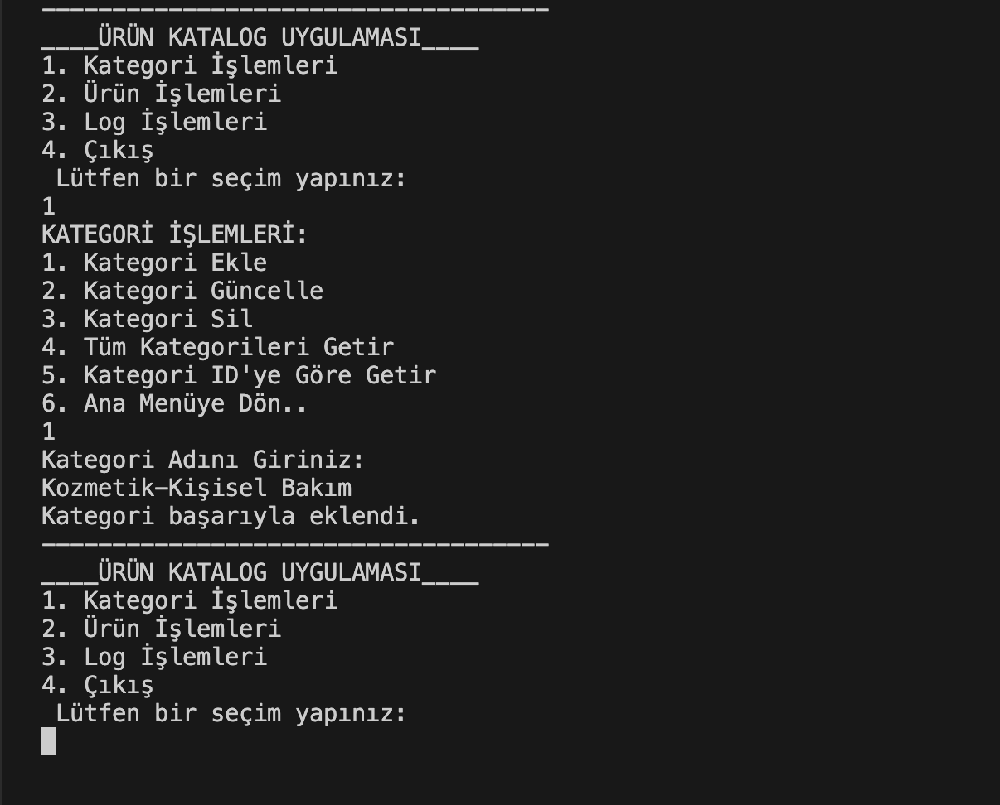
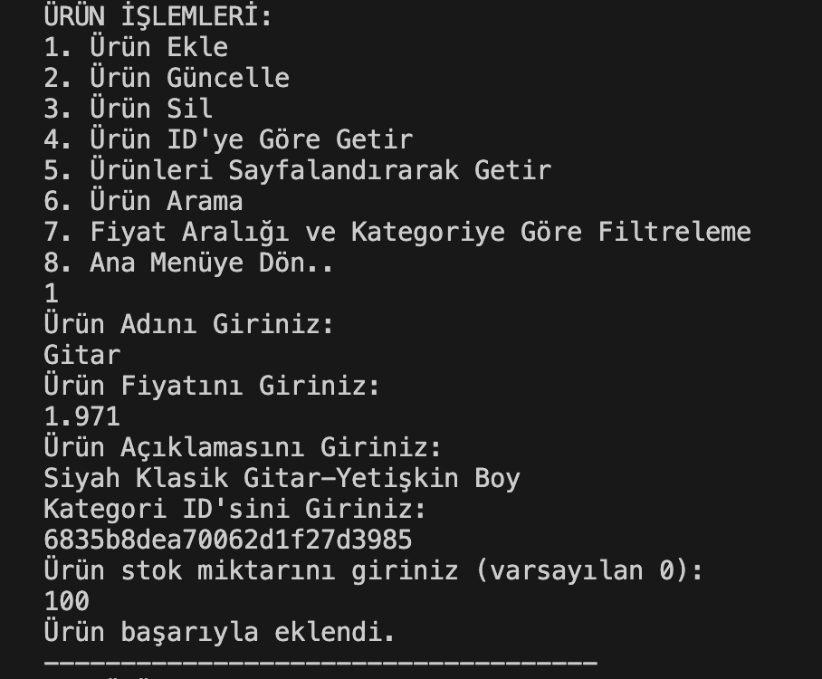
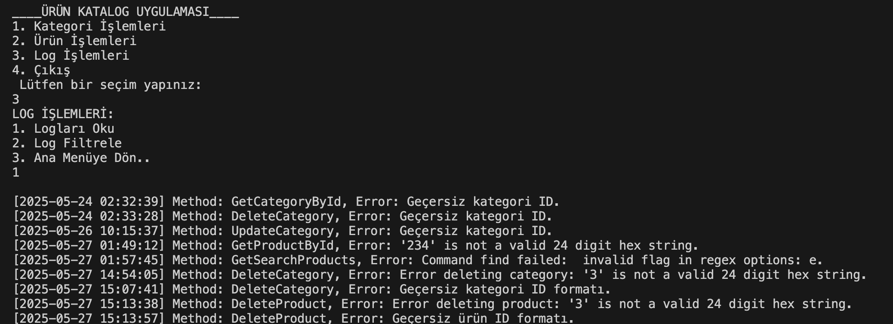
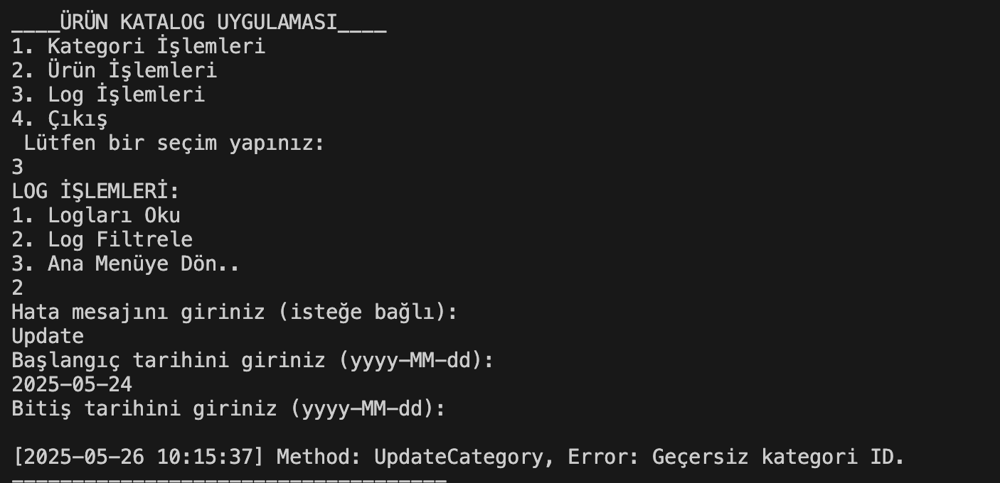

# 🛒 Ürün Kataloğu Uygulaması

Bu proje, **C#** ve **MongoDB** kullanılarak geliştirilen bir **ürün yönetim sistemi** örneğidir. Konsol tabanlı bu uygulama, ürün ve kategori yönetimi, arama, filtreleme, hata loglama gibi birçok temel özelliği içermektedir.

## 🎯 Amaç

Bu uygulamanın amacı, MongoDB veritabanı ile C# kullanarak etkileşim kurma yetkinliğini artırmak ve ürün/kategori gibi veriler üzerinde CRUD işlemleri gerçekleştirmektir. Aynı zamanda kullanıcı hatalarının yönetimi için basit bir loglama sistemi de sunulmaktadır.

---

## ⚙️ Kullanılan Teknolojiler

- C# (.NET Core veya .NET Framework)
- MongoDB
- MongoDB.Driver NuGet Paketi
- Konsol Arayüzü

---

## 📁 Proje Yapısı

### 1. MongoDB Yapısı



### 2. Proje Ana Yapısı



### 3. Konsol Arayüzü Örnekleri

#### 🗂️ Kategori Ekle




#### 📦 Ürün Ekle



#### 📄 Logları Okuma 



#### 📄 Logları Filtreleme 



---

## 🛠️ Hata Yönetimi

- Tüm hatalar `try-catch` blokları ile yakalanır.
- Hatalar `app_error.txt` dosyasına zaman damgası, mesaj ve metot bilgisi ile kaydedilir.
- Log dosyası okunabilir ve mesaj/zaman aralığına göre filtrelenebilir.

---

## 🖥️ Konsol Arayüzü Özellikleri

### 🛒 Ürün İşlemleri

- Ürün Ekle
- Ürün Güncelle (ID ile)
- Ürün Sil (ID ile)
- Ürün ID'ye Göre Getir
- Ürün Listele (Sayfalama ile)
- Ürün Arama (Ad/Açıklama içinde)
- Ürün Filtreleme (Fiyat ve/veya kategoriye göre)

### 📁 Kategori İşlemleri

- Kategori Ekle
- Kategori Güncelle (ID ile)
- Kategori Sil (ID ile)
- Tüm Kategorileri Getir
- Kategori ID'ye Göre Getir

### 📄 Hata Yönetimi

- Hata loglarını görüntüleme
- Belirli mesaj ya da tarih aralığı ile log arama

---

## ✅ Ek Gereksinimler

- Veri validasyonu yapılmalı (örnek: negatif fiyat girilememeli).
- ObjectId kullanımı MongoDB ile uyumlu olmalı.
- Anlamlı metot/isimlendirme ve yorum satırları ile temiz kod yazımı sağlanmalı.

---

## 🚀 Kurulum ve Çalıştırma

1. MongoDB'yi kurun ve servis çalıştığından emin olun.
2. Projeyi klonlayın veya kendi bilgisayarınızda oluşturun.
3. Gerekli NuGet paketlerini yükleyin:
   ```bash
   dotnet add package MongoDB.Driver
